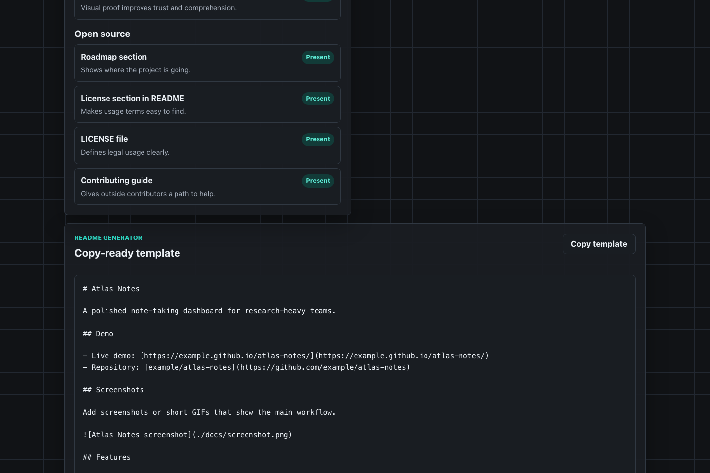

# GitHub Repo Polisher

GitHub Repo Polisher is a browser-only dashboard that audits a public GitHub repository and turns the result into practical README improvement suggestions.

It checks README coverage, repository metadata, engineering files, demo readiness, and open-source friendliness. It can read public GitHub repository information in the browser, and it also includes mock repositories for offline or rate-limited demos.

## Why I Built This

Small open-source projects often work correctly but look unfinished to new visitors. A missing screenshot, unclear setup command, weak roadmap, or absent contribution guide can make a useful project feel abandoned.

GitHub Repo Polisher is a small maintainer tool for checking those first-impression details before sharing a repository publicly.

## Current Status

- Status: public early release
- Version: `0.1.0`
- Runtime: browser-only frontend
- Primary audience: students, indie developers, and small open-source maintainers
- Main focus: practical repository polish, not automated code-quality judgment

## Features

- Parse public GitHub URLs such as `https://github.com/user/repo`
- Fetch public repository metadata without storing account credentials
- Check for README, LICENSE, `package.json`, GitHub Actions, and contribution guidance
- Detect README sections for Demo, Screenshots, Features, Tech Stack, Getting Started, Roadmap, and License
- Detect screenshots and install/run commands in README content
- Score repositories across five categories for a total of 100 points
- Group recommendations by high priority, medium priority, and optional polish
- Generate a copy-ready README template based on the repository name
- Provide two built-in sample repositories for offline use
- Support dark mode and responsive layouts

## Screenshots

These screenshots were captured from the app running locally with `npm run dev`.

### Dashboard


### README Generator



## Tech Stack

- Vite
- React
- TypeScript
- Plain CSS
- GitHub public REST API
- ESLint
- GitHub Actions

## Local Development

```bash
npm install
npm run dev
```

Build and preview the production bundle:

```bash
npm run build
npm run preview
```

Run lint checks:

```bash
npm run lint
```

## Maintenance Docs

- [Contributing Guide](CONTRIBUTING.md)
- [Security Policy](SECURITY.md)
- [Changelog](CHANGELOG.md)
- [Public Roadmap](docs/roadmap.md)
- [Release Checklist](docs/release-checklist.md)

## Privacy

GitHub Repo Polisher is frontend-only. Repository analysis happens in the browser. The app does not upload analysis results to a project server and does not require account login for the default public-repository workflow.

## Deploy to GitHub Pages

The Vite config uses `base: './'`, so the generated assets work under a repository subpath such as `https://user.github.io/github-repo-polisher/`.

One simple deployment path:

```bash
npm install
npm run build
```

Then publish the `dist` directory with your preferred GitHub Pages workflow. For example, you can use `actions/deploy-pages` in a separate deployment workflow after the CI workflow passes.

Repository settings path:

1. Open the GitHub repository settings.
2. Go to Pages.
3. Choose GitHub Actions as the build and deployment source.
4. Add a Pages deployment workflow that uploads `dist`.

## Roadmap

Near-term work is tracked in [docs/roadmap.md](docs/roadmap.md). Current priorities:

- Add optional scoring presets for web apps, libraries, CLIs, documentation sites, and small games
- Add real screenshots from the deployed app
- Add example before-and-after audit reports
- Add export to Markdown or JSON
- Add rule explanations with direct README patch suggestions
- Add GitHub Pages deployment workflow template generation

## License

MIT
